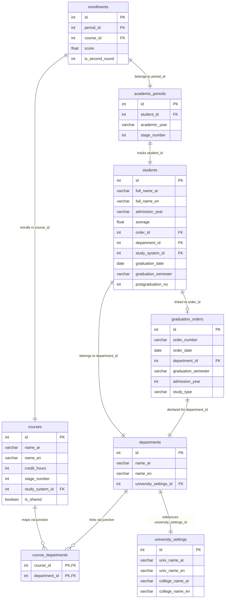

# 🎓 Certificate Manager — System Architecture & Documentation

Welcome to the **Certificate Manager** application. This document provides a comprehensive overview of the project's core objectives, database architecture, design philosophy, and system design.

---

## 🌟 Project Vision & Core Idea

The **Certificate Manager** is a high-performance, modern desktop application designed for universities and academic colleges to manage student records, degree paths, and graduation credentials. It automates the generation of official, beautiful, and bilingual (Arabic & English) graduation certificates, ensuring data integrity while eliminating human error in grade transcript computations.

### Key Capabilities
- **Bilingual Certificate Generation**: Instantly renders official graduation certificates in Microsoft Word format (`.docx`) using highly-tailored templates, inserting student grades, calculated averages, graduation sequence numbers, and active dean/dean-assistant signatories.
- **Dynamic Curriculum Builder**: Manages department course catalogs across multiple years, featuring a custom **Junction/Shared Courses architecture** that permits courses to be securely mapped to multiple departments simultaneously.
- **Stage-Aware Enrollment**: Features a stage-intelligent enrollment process that automatically restricts and sorts course dropdowns, allowing students to pick courses matching their current academic stage and below (backlog staging).
- **Graduation Batches & Orders**: Bridges student databases directly with ministerial graduation decrees by linking students to custom **Graduation Orders** (`order_id`), dynamically loading graduation dates, semesters, and postgraduation metadata.
- **Self-Healing MySQL Database**: Includes a state-of-the-art startup schema-healing system that verifies all active tables/columns and deploys required migrations seamlessly on the fly.
- **Modern User Experience**: Replaces basic Tkinter layouts with a premium, sleek custom dark/light theme designed with CustomTkinter (CTk), incorporating live fuzzy search matching, SidePanel edit forms, and paginated record lists.

---

## 🗄️ Database Architecture & Relational Schema

The application employs a highly normalized SQL structure, maintaining transactional consistency and referential integrity across the academic ledger.



### Strategic Data Integrations
1. **Student Graduation Flow**: When a student is linked to a `graduation_orders` record (via `order_id`), the system uses `COALESCE` to automatically draw the **Order Date** as their **Graduation Date** and the order's semester as their **Graduation Semester**. Manual overrides directly saved in `students` take precedence.
2. **Shared Courses Junction**: The `course_departments` table allows a single curriculum entry (like "Mathematics") to be marked as `is_shared` and associated with both Computer Science and Software Engineering departments, preventing catalog duplication.

---

## 🎨 User Interface & Experience Design

The application's UI is crafted to meet modern aesthetics while supporting rich Arabic and English typography, layouts, and reading directions.

### UI Style Pillars:
- **Curated Glassmorphic Themes**: Custom light/dark themes utilizing Outfit & Inter for high-quality English labels, alongside Outfit-inspired Arabic typography.
- **Visual Overlays (SidePanel)**: Screen forms (Add/Edit) are loaded into sliding SidePanels, keeping context visible to the user and preventing modal fatigue.
- **Dynamic Live Suggestions**: Search fields leverage fuzzy matching with ranking scores, allowing rapid filtering of student names as the user types.
- **12-Field Data Badges**: Core details cards represent information inside distinct rounded containers with structured, high-contrast values.

---

## 📂 Project Structure & Module Anatomy

The codebase is organized cleanly to separate data, UI presentation, and configuration details.

```text
├── .ai/
│   ├── cerebrum.md           # Central Bug Ledger and design rules repository
│   └── anatomy.md            # Map of files and modules
├── config.py                 # Color tokens, sizes, fonts, and window options
├── db.py                     # Connection manager, self-healing startup migrations, and grades utility
├── main.py                   # Main entry point, window init, and screen navigation router
├── verify_migration.py       # Comparative data integrity checking script
├── data/
│   └── repositories.py       # Centralized Repository Pattern (Data Access Layer)
├── screens/                  # Main presentation screens
│   ├── home_screen.py
│   ├── students_screen.py    # Identity cards, active periods, and grade panels
│   ├── courses_screen.py     # Curriculum listings and course catalog managers
│   ├── graduation_orders_screen.py # Ministerial decree registers and linkage tools
│   ├── personnel_screen.py   # Deanery signatures and administrative records
│   ├── certificate_screen.py # Bilingual certificate template binding and export
│   └── settings_screen.py    # Backup, restore, and local system setups
├── ui/                       # Reusable custom customtkinter widgets
│   ├── side_panel.py         # Sliding form panels
│   ├── record_list.py        # Modern table grid with RTL actions
│   └── pagination_bar.py     # Live multi-page result segmenters
└── templets/                 # Dean-certified Word (.docx) certificate files
```

---

## 🛠️ Operational & Verification Guide

### 1. Database Initialization
On every application launch, the initialization system in `db.py` automatically checks connection status and applies migrations to align local databases:
```python
from db import init_db
init_db()
```

### 2. Backup & Restore
Backups are triggered on demand from the Settings panel, invoking a secure sub-process call to the MySQL binaries:
- **Backup**: Outputs compressed, deanery-grade backup files `.sql`.
- **Restore**: Clears active records and reconstructs the data ledger from the chosen SQL dump.
